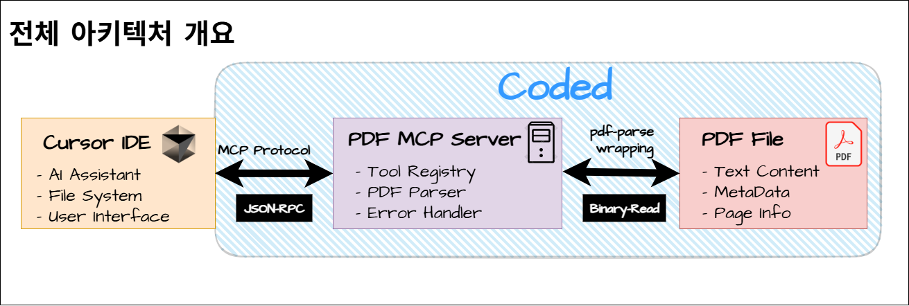

# PDF MCP Server

[한국어](README.md) | [English](README.eng.md)

A practical PDF parsing tool wrapped as an MCP (Model Context Protocol) server for Cursor IDE integration. 

## Architecture Overview



The PDF MCP Server acts as a bridge between Cursor IDE and PDF files through the MCP protocol. 

## Why This Exists

Cursor IDE's AI can't read PDF files natively, which is frankly annoying when you're trying to analyze documentation, research papers, or any PDF content. This MCP server bridges that gap by providing PDF parsing capabilities through the MCP protocol.

**Reality Check**: This isn't revolutionary. We're essentially wrapping existing PDF parsing libraries into an MCP interface. But sometimes the most practical solutions are the boring ones.

## Current Status

✅ **Completed:**
- Basic MCP server structure with McpServer API
- PDF text extraction using pdf-parse library
- PDF metadata extraction 
- PDF file validation
- Complete test suite (8/8 tests passing)
- TypeScript build system
- Docker-based development environment
- Cursor IDE integration completed and verified working

🔧 **Next Steps:**
- Page-by-page text extraction
- Table data extraction
- GitHub Actions CI/CD setup

## Features

### Current Implementation
- **extract_pdf_text**: Extract text content from PDF files (size limit: 100KB)
- **get_pdf_metadata**: Get PDF metadata (title, author, creation date, etc. + 200-char text preview)
- **validate_pdf**: Validate PDF file format and size limits

## Tech Stack

- **TypeScript** - Because type safety matters, even for wrapper projects
- **pdf-parse** - Battle-tested PDF parsing library
- **@modelcontextprotocol/sdk** v1.15.1 - Latest MCP SDK
- **zod** - Schema validation for MCP tools
- **Jest** - Testing framework
- **Docker** - Cross-platform development environment

## Installation

### Prerequisites
- Docker Desktop (with WSL integration enabled)
- Cursor IDE

### Development Setup

1. **Clone the repository:**
```bash
git clone https://github.com/EEager/pdf-mcp-server.git
cd pdf-mcp-server
```

2. **Install dependencies:**
```bash
docker run -it --rm -v ~/workspace/pdf-mcp-server:/app -w /app node:20 npm install
```

3. **Build the project:**
```bash
docker run --rm -v ~/workspace/pdf-mcp-server:/app -w /app node:20 npx tsc
```

### Cursor IDE Configuration

#### **Important: File Access Configuration**

The PDF MCP Server accesses files through Docker volume mounts. **Only files in mounted directories can be accessed.**

Add to your Cursor MCP settings file (`~/.cursor/mcp_servers.json` or `~/.config/cursor/mcp_servers.json`):

```json
{
  "mcpServers": {
    "pdf-parser": {
      "command": "docker",
      "args": [
        "run",
        "-i",
        "--rm",
        "-v", "\\\\wsl$\\Ubuntu\\home\\eager\\workspace\\pdf-mcp-server:/app",
        "-v", "D:\\cursor_mcp_dir:/workspace",
        "-w", "/app",
        "node:20",
        "node",
        "dist/index.js"
      ]
    }
  }
}
```

**Configuration Explanation:**
- `\\\\wsl$\\Ubuntu\\home\\eager\\workspace\\pdf-mcp-server:/app`: Mount MCP server code
- `D:\\cursor_mcp_dir:/workspace`: **Mount directory containing PDF files (Required!)**
- PDF files are only accessible via `/workspace/` path

**⚠️ Important**: Change `D:\\cursor_mcp_dir` to the actual Windows directory containing your PDF files.

#### **Verify Running MCP Server**

Cursor IDE automatically runs Docker containers:

```bash
# Check running containers
docker ps

# Example output:
# CONTAINER ID   IMAGE     COMMAND                  CREATED       STATUS       NAMES
# abc123def456   node:20   "node dist/index.js"     2 minutes ago Up 2 minutes suspicious_turing
```

## Usage

Once configured, you can use these commands in Cursor IDE:

### 1. PDF Text Extraction (extract_pdf_text)
```
User: "Can you read the content of /workspace/document.pdf?"

Response: Extracted text (up to 100KB) along with page count and basic metadata.
Large files are automatically truncated.
```

### 2. PDF Metadata Information (get_pdf_metadata)
```
User: "What's the metadata of /workspace/document.pdf?"

Response: Title, author, creation date, modification date, page count, and 200-character text preview.
```

### 3. PDF File Validation (validate_pdf)
```
User: "Is /workspace/document.pdf a valid PDF file?"

Response: Validation results including file format, size limits, and accessibility.
```

### MCP Tools Overview
Available MCP tools provided by the server:

| Tool Name | Description | Input Parameters | Output |
|-----------|-------------|------------------|--------|
| `extract_pdf_text` | Extract text from PDF | `filePath: string` | Text content, page count, metadata |
| `get_pdf_metadata` | Extract metadata | `filePath: string` | Title, author, creation date, etc. |
| `validate_pdf` | Validate PDF file | `filePath: string` | Validation status, error messages |

## Real-world Usage Example

### Example: Analyzing a 962-page Deep Learning Textbook

#### 1. validate_pdf
**Input:**
```json
{
  "filePath": "/workspace/01_study/ai_ml/pytorch_deep_learning_Intro.pdf"
}
```

**Result:**
```json
{
  "isValid": true,
  "filePath": "/workspace/01_study/ai_ml/pytorch_deep_learning_Intro.pdf",
  "message": "PDF file is valid"
}
```

#### 2. get_pdf_metadata
**Input:**
```json
{
  "filePath": "/workspace/01_study/ai_ml/pytorch_deep_learning_Intro.pdf"
}
```

**Result:**
```json
{
  "text": "Contents\n문서정보1\n00. 입문자들을위한조언(Q&A)2\n00.교육문의8\n00.\n유료\nE‑book\n안내\n9\n00.책과저자소개하기10\n01. [기초] ‑딥러닝을시작하기전에11\n01‑01코랩(Colab)과아나콘다12\n1.아나콘다(Anaconda)설치...",
  "pageCount": 962,
  "title": "딥 러닝 파이토치 교과서 - 입문부터 파인튜닝까지",
  "author": "이 책은 님이 구매하신 전자책입니다.",
  "creator": "WikiDocs",
  "producer": "xdvipdfmx (20210609)",
  "creationDate": "D:20250521134136+09'00'"
}
```

#### 3. extract_pdf_text
**Input:**
```json
{
  "filePath": "/workspace/01_study/ai_ml/pytorch_deep_learning_Intro.pdf"
}
```

**Result:**
```json
{
  "text": "Contents\n문서정보1\n00. 입문자들을위한조언(Q&A)2...[truncated at 100KB limit]",
  "pageCount": 962,
  "metadata": { "title": "딥 러닝 파이토치 교과서...", "author": "..." },
  "truncated": true,
  "originalLength": 868068
}
```

## Development

### Project Structure
```
pdf-mcp-server/
├── src/
│   ├── index.ts          # MCP server entry point
│   ├── pdf-parser.ts     # PDF parsing logic
│   └── types.ts          # TypeScript definitions
├── tests/
│   └── pdf-parser.test.ts # Jest test suite
├── docs/
│   └── images/           # Documentation images
├── dist/                 # Build output
├── package.json
├── tsconfig.json
└── README.md
```

### Development Scripts
```bash
# Build (Required)
docker run --rm -v ~/workspace/pdf-mcp-server:/app -w /app node:20 npx tsc

# Test
docker run -it --rm -v ~/workspace/pdf-mcp-server:/app -w /app node:20 npm test

# Server execution test (Optional - Cursor runs automatically)
docker run -it --rm -v ~/workspace/pdf-mcp-server:/app -w /app node:20 node dist/index.js
```

**Note**: Cursor IDE automatically runs the MCP server as a Docker container, so you only need to build during development.

### Debugging and Log Checking

#### Docker Container Logs
```bash
# Check running containers
docker ps

# Check container logs (by container name)
docker logs <CONTAINER_NAME>

# Real-time log monitoring
docker logs -f <CONTAINER_NAME>
```

#### Example Log Output
```json
{"result":{"content":[{"type":"text","text":"{\n  \"isValid\": true,\n  \"filePath\": \"/workspace/01_study/ai_ml/pytorch_deep_learning_Intro.pdf\",\n  \"message\": \"PDF file is valid\"\n}"}]},"jsonrpc":"2.0","id":16}
```

### Testing with MCP Inspector

```bash
# Test MCP server functionality
cd ~/workspace/pdf-mcp-server
npx @modelcontextprotocol/inspector node dist/index.js
```

## Implementation Notes

### Environment Challenges Solved
- **WSL/Windows Path Conflicts**: Resolved using Docker containerization
- **npm Permission Issues**: Docker isolation prevents file system conflicts
- **MCP SDK Version Mismatch**: Updated from non-existent 0.2.0 to latest 1.15.1
- **API Changes**: Migrated from legacy Server to new McpServer API
- **Large Text Processing**: Text size limits to prevent Cursor IDE crashes
- **Date Type Errors**: Safe date conversion functions

### Architecture Decisions
- **Modular Design**: Separate PDF parsing logic from MCP server logic
- **Comprehensive Testing**: Full test coverage with mocked dependencies
- **Type Safety**: Strict TypeScript configuration with zod validation
- **Error Handling**: Graceful error handling for file operations and PDF parsing
- **Performance Optimization**: Text size limits for client stability

## Troubleshooting

### Common Issues

**Cannot read PDF files:**
- Check Docker volume mount configuration: `"D:\\your_pdf_dir:/workspace"`
- Ensure file path starts with `/workspace/`
- Verify Docker Desktop WSL integration is enabled

**MCP server connection failure:**
- Ensure Docker Desktop is running
- Verify Cursor MCP settings file path is correct
- Restart Cursor IDE

**Build errors:**
- Build in WSL: `docker run --rm -v ~/workspace/pdf-mcp-server:/app -w /app node:20 npx tsc`
- Reinstall dependencies: `docker run -it --rm -v ~/workspace/pdf-mcp-server:/app -w /app node:20 npm install`

## Limitations

- **File Access**: Only files in Docker volume-mounted directories are accessible
- **File Size**: Large PDFs (>100MB) will be rejected for performance reasons
- **Text Size**: Extracted text is limited to 100KB (for Cursor IDE stability)
- **Metadata**: Text preview is limited to 200 characters
- **Complex Layouts**: Tables and multi-column layouts may not parse perfectly
- **Scanned PDFs**: OCR support is planned but not yet implemented

## License

MIT License - because sharing is caring, and this is just a wrapper anyway.

## Acknowledgments

- [pdf-parse](https://www.npmjs.com/package/pdf-parse) - The actual PDF parsing heavy lifting
- [MCP Protocol](https://modelcontextprotocol.io/) - For making this integration possible  
- [Cursor IDE](https://cursor.sh/) - For building an IDE that's actually worth extending
- Docker community - For solving our environment compatibility nightmares

---

**Status**: Basic functionality completed and verified working. Successfully analyzed a 962-page PDF textbook! Ready for real-world productivity use.