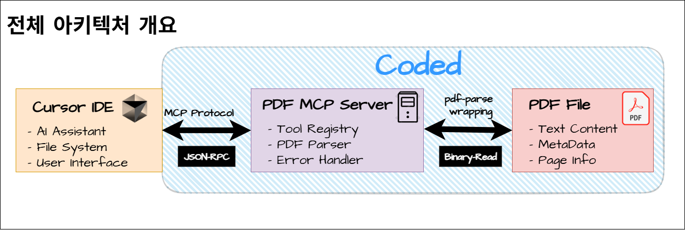

# PDF MCP 서버

[한국어](README.md) | [English](README.eng.md)

PDF 파싱 도구를 MCP(Model Context Protocol) 서버로 래핑해서 Cursor IDE와 연동하는 실용적인 프로젝트입니다.

## ✅아키텍처 개요



PDF MCP 서버는 MCP 프로토콜을 통해 Cursor IDE와 PDF 파일 사이의 다리 역할을 합니다.

## ✅왜 만들었나?

Cursor IDE의 AI는 기본적으로 PDF 파일을 읽지 못합니다. 문서나 논문, PDF 자료를 분석하려고 할 때마다 답답했죠. 이 MCP 서버가 그 문제를 해결해줍니다.

**현실적 고백**: 혁신적인 건 아닙니다. 기존 PDF 파싱 라이브러리를 MCP 인터페이스로 감싼 것뿐이에요. 하지만 때로는 가장 실용적인 해결책이 가장 지루한 해결책이기도 하죠.

## ✅기능

### 현재 구현된 기능
- **extract_pdf_text**: PDF 파일에서 텍스트 추출
- **get_pdf_metadata**: PDF 메타데이터 추출 (제목, 작성자, 생성일 등)
- **validate_pdf**: PDF 파일 형식 및 크기 제한 검증

### 계획된 기능
- [ ] 페이지별 텍스트 추출
- [ ] 표 감지 및 추출
- [ ] 이미지 추출
- [ ] 스캔된 PDF OCR 지원
- [ ] 배치 처리


## ✅기술 스택
- **TypeScript** - 래퍼 프로젝트라도 타입 안정성은 중요하니까
- **pdf-parse** - 검증된 PDF 파싱 라이브러리
- **@modelcontextprotocol/sdk** v1.15.1 - 최신 MCP SDK
- **zod** - MCP 도구 스키마 검증
- **Jest** - 테스트 프레임워크
- **Docker** - 크로스 플랫폼 개발 환경

## ✅설치

### 필수 요구사항
- Docker (권장) 또는 Node.js 18+
- Cursor IDE

### 방법 1: Docker 설정 (권장)

WSL/Windows 경로 충돌과 npm 권한 문제를 피할 수 있습니다.

1. **리포지토리 클론:**
```bash
git clone https://github.com/yourusername/pdf-mcp-server.git
cd pdf-mcp-server
```

2. **의존성 설치:**
```bash
docker run -it --rm -v ~/workspace/pdf-mcp-server:/app -w /app node:20 npm install
```

3. **프로젝트 빌드:**
```bash
docker run -it --rm -v ~/workspace/pdf-mcp-server:/app -w /app node:20 npm run build
```

4. **테스트 실행:**
```bash
docker run -it --rm -v ~/workspace/pdf-mcp-server:/app -w /app node:20 npm test
# 테스트가 성공적으로 완료되면 다음과 같은 메시지가 표시됩니다: "PDF MCP Server running on stdio"
```

### 방법 2: 네이티브 Node.js 설정

네이티브 Node.js를 선호한다면 (WSL에서 경로 문제 발생 가능):

```bash
npm install
npm run build
npm test
```

### Cursor IDE 설정

Cursor MCP 설정 파일(`~/.cursor/mcp_servers.json`)에 추가:

```json
{
  "mcpServers": {
    "pdf-parser": {
      "command": "node",
      "args": ["/path/to/pdf-mcp-server/dist/index.js"]
    }
  }
}
```

## ✅사용법

설정이 완료되면 Cursor IDE에서 다음과 같이 사용할 수 있습니다:

### 1. PDF 텍스트 추출 (extract_pdf_text)
```
사용자: "document.pdf 파일의 내용을 읽어줄 수 있어?"

응답: PDF 파일에서 추출된 전체 텍스트와 페이지 수, 기본 메타데이터가 함께 제공됩니다.
```

### 2. PDF 메타데이터 확인 (get_pdf_metadata)
```
사용자: "이 PDF 파일의 메타데이터가 뭐야?"

응답: 제목, 작성자, 생성일, 수정일, 페이지 수 등의 상세 정보가 제공됩니다.
```

### 3. PDF 파일 검증 (validate_pdf)
```
사용자: "이 파일이 유효한 PDF인가?"

응답: 파일 형식, 크기 제한, 접근 가능성을 확인한 검증 결과가 제공됩니다.
```

### MCP 도구 목록
서버가 제공하는 MCP 도구들:

| 도구명 | 설명 | 입력 파라미터 | 출력 |
|--------|------|---------------|------|
| `extract_pdf_text` | PDF 텍스트 추출 | `filePath: string` | 텍스트, 페이지수, 메타데이터 |
| `get_pdf_metadata` | 메타데이터 추출 | `filePath: string` | 제목, 작성자, 생성일 등 |
| `validate_pdf` | PDF 검증 | `filePath: string` | 유효성 여부, 오류 메시지 |

## ✅개발

### 프로젝트 구조
```
pdf-mcp-server/
├── src/
│   ├── index.ts          # MCP 서버 진입점
│   ├── pdf-parser.ts     # PDF 파싱 로직
│   └── types.ts          # TypeScript 타입 정의
├── tests/
│   └── pdf-parser.test.ts # Jest 테스트 스위트
├── docs/
│   └── images/           # 문서 이미지
├── dist/                 # 빌드 결과물
├── package.json
├── tsconfig.json
└── README.md
```

### 개발 스크립트
```bash
# Docker 사용 (권장)
docker run -it --rm -v ~/workspace/pdf-mcp-server:/app -w /app node:20 npm run dev
docker run -it --rm -v ~/workspace/pdf-mcp-server:/app -w /app node:20 npm run build
docker run -it --rm -v ~/workspace/pdf-mcp-server:/app -w /app node:20 npm test

# 네이티브 Node.js
npm run dev        # 개발 모드 (핫 리로드)
npm run build      # 프로덕션 빌드
npm run test       # 테스트 실행
npm run lint       # 코드 린트
npm run format     # Prettier로 코드 포맷팅
```

### MCP Inspector로 테스트

```bash
# MCP 서버 기능 테스트
npx @modelcontextprotocol/inspector node dist/index.js
```


## ✅구현 노트

### 해결된 환경 문제들
- **WSL/Windows 경로 충돌**: Docker 컨테이너화로 해결
- **npm 권한 문제**: Docker 격리로 파일 시스템 충돌 방지
- **MCP SDK 버전 불일치**: 존재하지 않는 0.2.0에서 최신 1.15.1로 업데이트
- **API 변경**: 레거시 Server에서 새로운 McpServer API로 마이그레이션

### 아키텍처 결정사항
- **모듈러 설계**: PDF 파싱 로직과 MCP 서버 로직 분리
- **포괄적 테스트**: 목킹된 의존성으로 완전한 테스트 커버리지
- **타입 안전성**: zod 검증과 함께 엄격한 TypeScript 설정
- **에러 핸들링**: 파일 작업과 PDF 파싱에 대한 우아한 에러 처리

## ✅문제 해결

### 일반적인 문제들

**UNC 경로 오류로 npm install 실패:**
- 네이티브 Node.js 대신 Docker 방식 사용
- Windows Command Prompt가 아닌 WSL에서 실행하는지 확인

**TypeScript 컴파일 오류:**
- Node.js 버전 확인 (18+ 필요)
- 모든 의존성이 설치되었는지 확인

**Cursor에서 MCP 서버 인식 안됨:**
- mcp_servers.json의 경로가 올바른지 확인
- 서버가 성공적으로 빌드되었는지 먼저 확인

## ✅제한사항

- **파일 크기**: 큰 PDF(100MB 이상)는 성능상 이유로 거부됨
- **복잡한 레이아웃**: 표나 다단 레이아웃은 완벽하게 파싱되지 않을 수 있음
- **스캔된 PDF**: OCR 지원은 계획 중이지만 아직 미구현
- **보안**: 악성코드 스캔이나 악성 PDF 탐지 기능 없음

## ✅라이선스

MIT 라이선스 - 공유가 배려니까, 그리고 어차피 래퍼일 뿐이니까.

## ✅감사의 말

- [pdf-parse](https://www.npmjs.com/package/pdf-parse) - 실제 PDF 파싱의 무거운 작업을 담당
- [MCP Protocol](https://modelcontextprotocol.io/) - 이런 연동을 가능하게 해준
- [Cursor IDE](https://cursor.sh/) - 확장할 가치가 있는 IDE를 만들어준
- Docker 커뮤니티 - 환경 호환성 악몽을 해결해준

---

**상태**: 초기 개발 단계. 기본 기능은 작동하지만 거친 부분들과 브레이킹 체인지를 예상하세요. 생산성 도구로 포장된 학습 프로젝트입니다.