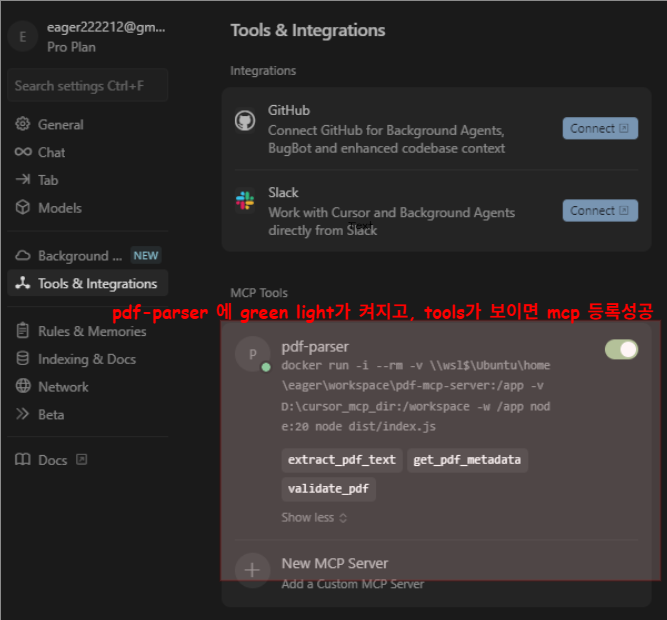

# PDF MCP 서버

[한국어](README.md) | [English](README.eng.md)

PDF 파싱 도구를 MCP(Model Context Protocol) 서버로 래핑해서 Cursor IDE와 연동하는 실용적인 프로젝트입니다.

## ✅아키텍처 개요


PDF MCP 서버는 MCP 프로토콜을 통해 Cursor IDE와 PDF 파일 사이의 다리 역할을 합니다.

## ✅왜 만들었나?

Cursor IDE의 AI는 기본적으로 PDF 파일을 읽지 못합니다. 문서나 논문, PDF 자료를 분석하려고 할 때마다 답답했죠. 이 MCP 서버가 그 문제를 해결해줍니다.

**현실적 고백**: 혁신적인 건 아닙니다. 기존 PDF 파싱 라이브러리를 MCP 인터페이스로 감싼 것뿐이에요. 하지만 때로는 가장 실용적인 해결책이 가장 지루한 해결책이기도 하죠.

## ✅현재 상태

🔧**완성된 것들:**
- McpServer API 기반 MCP 서버 구조
- pdf-parse 라이브러리를 이용한 PDF 텍스트 추출
- PDF 메타데이터 추출
- PDF 파일 검증 기능
- 완전한 테스트 스위트 (8/8 테스트 통과)
- TypeScript 빌드 시스템
- Docker 기반 개발 환경
- Cursor IDE 연동 완료 및 실제 동작 확인

🔧 **다음 단계:**
- 페이지별 텍스트 추출
- 표 데이터 추출
- GitHub Actions CI/CD 설정

## ✅기능

### 현재 구현된 기능
- **extract_pdf_text**: PDF 파일에서 텍스트 추출 (크기 제한: 100KB)
- **get_pdf_metadata**: PDF 메타데이터 추출 (제목, 작성자, 생성일 등 + 텍스트 미리보기 200자)
- **validate_pdf**: PDF 파일 형식 및 크기 제한 검증

## ✅기술 스택

- **TypeScript** - 래퍼 프로젝트라도 타입 안정성은 중요하니까
- **pdf-parse** - 검증된 PDF 파싱 라이브러리
- **@modelcontextprotocol/sdk** v1.15.1 - 최신 MCP SDK
- **zod** - MCP 도구 스키마 검증
- **Jest** - 테스트 프레임워크
- **Docker** - 크로스 플랫폼 개발 환경

## ✅설치

### 필수 요구사항
- Docker Desktop (WSL 통합 활성화)
- Cursor IDE

### 개발 환경 설정

1. **리포지토리 클론:**
```bash
git clone https://github.com/yourusername/pdf-mcp-server.git
cd pdf-mcp-server
```

2. **의존성 설치:**
```bash
docker run -it --rm -v ~/workspace/pdf-mcp-server:/app -w /app node:20 npm install
```

3. **프로젝트 빌드:**
```bash
docker run --rm -v ~/workspace/pdf-mcp-server:/app -w /app node:20 npx tsc
```

4. **프로젝트 테스트(선택사항):**
```bash
# 실행해보고 docker ps -a에서 잘 돌아가는지 확인하세요
docker run -it --rm -v ~/workspace/pdf-mcp-server:/app -w /app node:20 node dist/index.js
```

## ✅Cursor IDE 설정
[Cursor Settings] - [Tools & Integrations] - [Add Custom MCP]
를 통해 mcp.json 설정 파일을 수정할 수 있습니다. 


#### **중요: 파일 접근 권한 설정**

PDF MCP 서버는 Docker 볼륨 마운트를 통해 파일에 접근합니다. **마운트된 디렉토리의 파일만 읽을 수 있습니다.**

Cursor MCP 설정 파일(`~/.cursor/mcp.json` 또는 `~/.config/cursor/mcp.json`)에 추가:
(설정파일은 cursor update 상황에 따라 바뀔 수 있슴둥)

```json
{
  "mcpServers": {
    "pdf-parser": {
      "command": "docker",
      "args": [
        "run",
        "-i",
        "--rm",
        // !본인의 pdf-mcp-server 설치 경로로 수정하세요. 아래의 경우 wsl환경의 workspace 경로입니다.
        "-v", "\\\\wsl$\\Ubuntu\\home\\eager\\workspace\\pdf-mcp-server:/app", 

        // !PDF 파일들이 저장된 폴더 경로로 수정하세요. 아래의 경우 cursor_mcp_dir 폴더 밑에 pdf 파일들이 존재합니다. 
        "-v", "D:\\cursor_mcp_dir:/workspace",
        "-w", "/app",
        "node:20",
        "node",
        "dist/index.js"
      ]
    }
  }
}
```

**설정 설명:**
- `\\\\wsl$\\Ubuntu\\home\\eager\\workspace\\pdf-mcp-server:/app`: MCP 서버 코드 마운트
- `D:\\cursor_mcp_dir:/workspace`: **PDF 파일이 있는 디렉토리 마운트 (필수!)**
- PDF 파일은 `/workspace/` 경로로만 접근 가능

**⚠️ 중요**: `D:\\cursor_mcp_dir`를 실제 PDF 파일들이 있는 Windows 디렉토리로 변경하세요.

#### **실행 중인 MCP 서버 확인**

Cursor IDE는 자동으로 Docker 컨테이너를 실행합니다:

```bash
# 실행 중인 컨테이너 확인
docker ps

# 예시 출력:
# CONTAINER ID   IMAGE     COMMAND                  CREATED       STATUS       NAMES
# abc123def456   node:20   "node dist/index.js"     2 minutes ago Up 2 minutes suspicious_turing
```

## ✅**cursor IDE에서 정상적으로 mcp등록이 된 경우**

mcp.json를 저장한 후, 바로 mcp 등록이 된것을 확인할 수 있습니다. 



## ✅사용법

설정이 완료되면 Cursor IDE에서 다음과 같이 사용할 수 있습니다:

### 1. PDF 텍스트 추출 (extract_pdf_text)
```
사용자: "/workspace/document.pdf 파일의 내용을 읽어줄 수 있어?"

응답: PDF 파일에서 추출된 텍스트(최대 100KB)와 페이지 수, 기본 메타데이터가 함께 제공됩니다.
큰 파일은 자동으로 잘림 처리됩니다.
```

### 2. PDF 메타데이터 확인 (get_pdf_metadata)
```
사용자: "/workspace/document.pdf 파일의 메타데이터가 뭐야?"

응답: 제목, 작성자, 생성일, 수정일, 페이지 수와 텍스트 미리보기(200자)가 제공됩니다.
```

### 3. PDF 파일 검증 (validate_pdf)
```
사용자: "/workspace/document.pdf 파일이 유효한 PDF인가?"

응답: 파일 형식, 크기 제한, 접근 가능성을 확인한 검증 결과가 제공됩니다.
```

### MCP 도구 목록
서버가 제공하는 MCP 도구들:

| 도구명 | 설명 | 입력 파라미터 | 출력 |
|--------|------|---------------|------|
| `extract_pdf_text` | PDF 텍스트 추출 | `filePath: string` | 텍스트, 페이지수, 메타데이터 |
| `get_pdf_metadata` | 메타데이터 추출 | `filePath: string` | 제목, 작성자, 생성일 등 |
| `validate_pdf` | PDF 검증 | `filePath: string` | 유효성 여부, 오류 메시지 |

## ✅실제 시험 결과

### 예시: 962페이지 딥러닝 교재 분석

#### 1. validate_pdf
**입력:**
```json
{
  "filePath": "/workspace/01_study/ai_ml/pytorch_deep_learning_Intro.pdf"
}
```

**결과:**
```json
{
  "isValid": true,
  "filePath": "/workspace/01_study/ai_ml/pytorch_deep_learning_Intro.pdf",
  "message": "PDF file is valid"
}
```

#### 2. get_pdf_metadata
**입력:**
```json
{
  "filePath": "/workspace/01_study/ai_ml/pytorch_deep_learning_Intro.pdf"
}
```

**결과:**
```json
{
  "text": "Contents\n문서정보1\n00. 입문자들을위한조언(Q&A)2\n00.교육문의8\n00.\n유료\nE‑book\n안내\n9\n00.책과저자소개하기10\n01. [기초] ‑딥러닝을시작하기전에11\n01‑01코랩(Colab)과아나콘다12\n1.아나콘다(Anaconda)설치...",
  "pageCount": 962,
  "title": "딥 러닝 파이토치 교과서 - 입문부터 파인튜닝까지",
  "author": "이 책은 안혜정(wjddk582@naver.com)님이 구매하신 전자책입니다.",
  "creator": "WikiDocs",
  "producer": "xdvipdfmx (20210609)",
  "creationDate": "D:20250521134136+09'00'"
}
```

#### 3. extract_pdf_text
**입력:**
```json
{
  "filePath": "/workspace/01_study/ai_ml/pytorch_deep_learning_Intro.pdf"
}
```

**결과:**
```json
{
  "text": "Contents\n문서정보1\n00. 입문자들을위한조언(Q&A)2...[100KB 제한으로 잘림]",
  "pageCount": 962,
  "metadata": { "title": "딥 러닝 파이토치 교과서...", "author": "..." },
  "truncated": true,
  "originalLength": 868068
}
```

### Cursor IDE의 채팅에서 MCP 도구 사용 결과


## ✅개발

### 프로젝트 구조
```
pdf-mcp-server/
├── src/
│   ├── index.ts          # MCP 서버 진입점
│   ├── pdf-parser.ts     # PDF 파싱 로직
│   └── types.ts          # TypeScript 타입 정의
├── tests/
│   └── pdf-parser.test.ts # Jest 테스트 스위트
├── docs/
│   └── images/           # 문서 이미지
├── dist/                 # 빌드 결과물
├── package.json
├── tsconfig.json
└── README.md
```

### 개발 스크립트
```bash
# 빌드 (필수)
docker run --rm -v ~/workspace/pdf-mcp-server:/app -w /app node:20 npx tsc

# 테스트
docker run -it --rm -v ~/workspace/pdf-mcp-server:/app -w /app node:20 npm test

# 서버 실행 테스트 (선택사항 - Cursor가 자동으로 실행함)
docker run -it --rm -v ~/workspace/pdf-mcp-server:/app -w /app node:20 node dist/index.js
```

**참고**: Cursor IDE가 MCP 서버를 자동으로 Docker 컨테이너로 실행하므로, 개발 시에는 빌드만 하면 됩니다.

### 디버깅 및 로그 확인

#### Docker 컨테이너 로그 확인
```bash
# 실행 중인 컨테이너 확인
docker ps

# 컨테이너 로그 확인 (컨테이너 이름으로)
docker logs <CONTAINER_NAME>

# 실시간 로그 확인
docker logs -f <CONTAINER_NAME>
```

#### 예시 로그 출력
```json
{"result":{"content":[{"type":"text","text":"{\n  \"isValid\": true,\n  \"filePath\": \"/workspace/01_study/ai_ml/pytorch_deep_learning_Intro.pdf\",\n  \"message\": \"PDF file is valid\"\n}"}]},"jsonrpc":"2.0","id":16}
```

### MCP Inspector로 테스트

```bash
# MCP 서버 기능 테스트
cd ~/workspace/pdf-mcp-server
npx @modelcontextprotocol/inspector node dist/index.js
```

## ✅구현 노트

### 해결된 환경 문제들
- **WSL/Windows 경로 충돌**: Docker 컨테이너화로 해결
- **npm 권한 문제**: Docker 격리로 파일 시스템 충돌 방지
- **MCP SDK 버전 불일치**: 존재하지 않는 0.2.0에서 최신 1.15.1로 업데이트
- **API 변경**: 레거시 Server에서 새로운 McpServer API로 마이그레이션
- **대용량 텍스트 처리**: Cursor IDE 터짐 방지를 위한 텍스트 크기 제한
- **날짜 타입 오류**: 안전한 날짜 변환 함수로 해결

### 아키텍처 결정사항
- **모듈러 설계**: PDF 파싱 로직과 MCP 서버 로직 분리
- **포괄적 테스트**: 목킹된 의존성으로 완전한 테스트 커버리지
- **타입 안전성**: zod 검증과 함께 엄격한 TypeScript 설정
- **에러 핸들링**: 파일 작업과 PDF 파싱에 대한 우아한 에러 처리
- **성능 최적화**: 텍스트 크기 제한으로 클라이언트 안정성 확보

## ✅문제 해결

### 일반적인 문제들

**PDF 파일을 읽을 수 없음:**
- Docker 볼륨 마운트 설정 확인: `"D:\\your_pdf_dir:/workspace"`
- 파일 경로가 `/workspace/` 로 시작하는지 확인
- Docker Desktop WSL 통합이 활성화되어 있는지 확인

**MCP 서버 연결 실패:**
- Docker Desktop이 실행 중인지 확인
- Cursor MCP 설정 파일 경로가 올바른지 확인
- Cursor IDE 재시작

**빌드 오류:**
- WSL에서 빌드: `docker run --rm -v ~/workspace/pdf-mcp-server:/app -w /app node:20 npx tsc`
- 의존성 재설치: `docker run -it --rm -v ~/workspace/pdf-mcp-server:/app -w /app node:20 npm install`

## 제한사항

- **파일 접근**: Docker 볼륨 마운트된 디렉토리의 파일만 접근 가능
- **파일 크기**: 큰 PDF(100MB 이상)는 성능상 이유로 거부됨
- **텍스트 크기**: 추출된 텍스트는 100KB로 제한 (Cursor IDE 안정성)
- **메타데이터**: 텍스트 미리보기는 200자로 제한
- **복잡한 레이아웃**: 표나 다단 레이아웃은 완벽하게 파싱되지 않을 수 있음
- **스캔된 PDF**: OCR 지원은 계획 중이지만 아직 미구현

## 라이선스

MIT 라이선스 - 공유가 배려니까, 그리고 어차피 래퍼일 뿐이니까.

## 감사의 말

- [pdf-parse](https://www.npmjs.com/package/pdf-parse) - 실제 PDF 파싱의 무거운 작업을 담당
- [MCP Protocol](https://modelcontextprotocol.io/) - 이런 연동을 가능하게 해준
- [Cursor IDE](https://cursor.sh/) - 확장할 가치가 있는 IDE를 만들어준
- Docker 커뮤니티 - 환경 호환성 악몽을 해결해준
